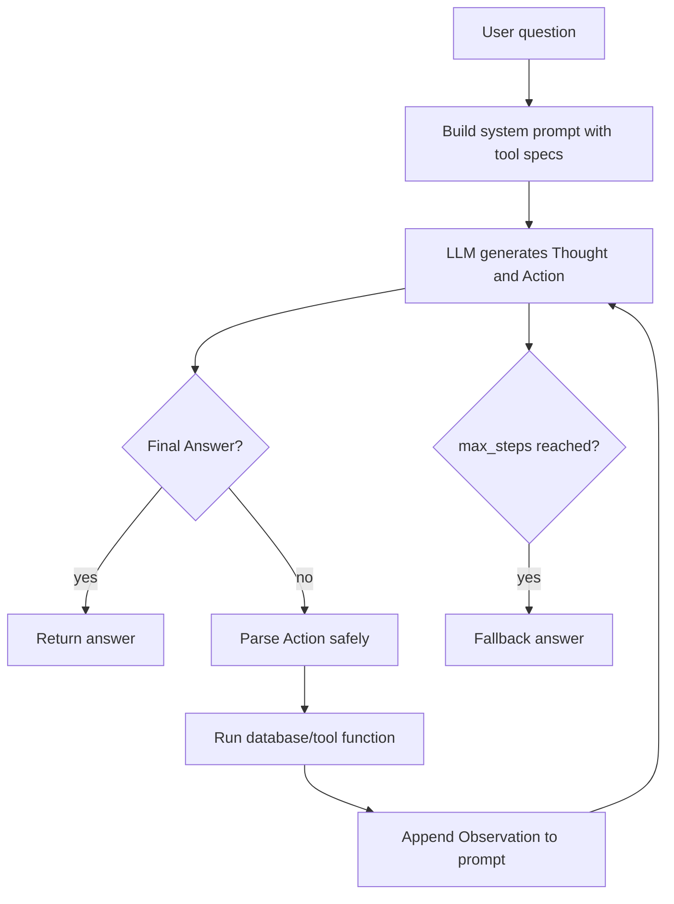

# Group Report: Lab 3 - Chatbot vs ReAct Agent

- **Team Name**: Team_076
- **Team Members**: Vu Hai Duong, Hoang Hai, Vu Thanh Loc
- **Deployment Date**: 2026-06-01

---

## 1. Executive Summary

The project compares a direct chatbot baseline against a ReAct agent for school information lookup. The agent answers user questions by calling database-backed tools instead of relying on model memory.

Final offline evaluation:

- **Test set**: 6 cases covering exam lookup, room location, student range lookup, subject-filtered student lookup, and student profile lookup.
- **Chatbot baseline**: `6/6` successful cases after adding direct tool-aware lookup.
- **ReAct agent**: `6/6` successful cases.
- **Demo**: `web_chatbot.py` provides a local browser chat UI with new chat and chat history.

---

## 2. System Architecture and Tooling

### 2.1 ReAct Loop Implementation

The core agent is implemented in `src/agent/agent.py`.



Important implementation details:

- `max_steps=5` prevents runaway loops and uncontrolled cost.
- `_extract_action()` parses tool calls with nested parentheses and quoted strings.
- `_parse_args()` supports JSON object arguments and simple `key=value` arguments.
- Errors are converted into observations so the LLM can recover.
- The system prompt is written in Vietnamese with strict scope, tool-first, anti-hallucination, and privacy rules. See `report/PROMPT_GUARDRAILS.md`.

### 2.2 Tool Definitions

| Tool Name | Input Format | Use Case |
| :--- | :--- | :--- |
| `get_exam_info` | `{"student_id":"1","subject_name":"Big Data"}` | Find exam date, time, and room. |
| `search_room_location` | `{"room":"C401"}` | Convert room code to building/floor location. |
| `get_student_schedule` | `{"student_id":"2A202600001","day_of_week":3}` | Find a student's schedule. |
| `get_daily_schedule` | `{"day_of_week":2,"room":"C401","limit":10}` | Find schedules by day, room, and optional student. |
| `get_student_profile` | `{"student_id":"2A202600632"}` | Find a student's profile. |
| `list_students` | `{"start":101,"end":200,"subject_name":"Hoc may"}` | List students by range and/or subject. |

### 2.3 Provider Switching

Providers share the `LLMProvider` interface:

- `OpenAIProvider`: live OpenAI API, default web model `gpt-4o-mini`.
- `GeminiProvider`: live Gemini API.
- `LocalProvider`: local GGUF model via `llama-cpp-python`.
- `MockProvider`: deterministic offline provider for tests and reproducible evaluation.

Provider selection is controlled through `.env`:

```env
DEFAULT_PROVIDER=openai
DEFAULT_MODEL=gpt-4o-mini
```

---

## 3. Tool Design Evolution

### v1: Minimal exam lookup

Initial tools focused on two-step exam queries:

- `get_exam_info`
- `search_room_location`

This was enough for questions such as: "When is my Big Data exam and where is the room?"

### v2: School database agent

The tool layer was expanded after testing real user questions:

- Student profile lookup.
- Student schedule lookup.
- Daily schedule lookup by room/day.
- Student list lookup by range and subject.

### v2 data fix

The SQL dump stores IDs inconsistently:

- `Students.student_id`: `2A202600001`
- `Schedules.student_id`: `1`

The `list_students` tool now joins these tables using the numeric suffix so subject-filtered queries return correct data.

---

## 4. Telemetry and Performance Dashboard

Telemetry is implemented in `src/telemetry/logger.py` and `src/telemetry/metrics.py`.

Logged events:

- `AGENT_START`
- `AGENT_STEP`
- `TOOL_CALL`
- `TOOL_RESULT`
- `LLM_METRIC`
- `AGENT_END`

Tracked metrics:

- Provider and model.
- Prompt tokens.
- Completion tokens.
- Total tokens.
- Completion-to-prompt token ratio.
- Latency in milliseconds.
- Estimated cost.

Console logging is disabled by default for a clean demo. JSON logs are still written to `logs/YYYY-MM-DD.log`. Console logs can be enabled with:

```env
LOG_TO_CONSOLE=true
```

---

## 5. Trace Quality and Failure Analysis

Full examples are documented in `report/TOOL_CALL_EXAMPLES.md`.

### Successful trace: exam + room

The agent first calls `get_exam_info`, observes a room code, then calls `search_room_location`. This demonstrates real multi-step reasoning.

### Successful trace: range query

For "Cho toi danh sach sinh vien tu 101 den 105", the agent calls:

```text
Action: list_students({"start":101,"end":105})
```

### Failed trace: parser bug

Agent v1 used a simple regex for `Action: tool(args)`. It failed when a JSON string contained parentheses, such as `"Math (A)"`.

Fix:

- Replace simple regex parsing with a character scanner.
- Track quote state, escape characters, and parenthesis depth.
- Return controlled parser observations instead of crashing.

### Failed trace: database join mismatch

Subject-filtered student lookup initially returned no rows because `Schedules.student_id` and `Students.student_id` used different formats.

Fix:

- Join schedules to students using the numeric suffix of the student ID.

---

## 6. Evaluation and Analysis

Evaluation script:

```bash
.venv\Scripts\python.exe run_end_to_end.py
```

The generated report is `report/END_TO_END_REPORT.md`.

Latest run:

```text
Total test cases: 6
Chatbot success: 6/6
ReAct agent success: 6/6
LLM requests tracked: 15
Total tokens estimated: 1961
Average tokens/request: 130.73
Average completion/prompt ratio: 0.9103
Total cost estimate: $0.003922
```

The test suite covers:

- Exam lookup with room location.
- Student list by subject.
- Student list by numeric range.
- Student profile lookup.

Comparison:

| Case Type | Chatbot Baseline | ReAct Agent | Winner |
| :--- | :--- | :--- | :--- |
| Simple profile lookup | Directly calls profile lookup | Calls `get_student_profile` via ReAct | Draw |
| Exam + room location | Direct tool lookup with room enrichment | Chains `get_exam_info` and `search_room_location` | Draw |
| Student range list | Directly calls `list_students(start,end)` | Calls `list_students(start,end)` via ReAct | Draw |
| Subject-filtered list | Directly calls `list_students(subject_name)` | Calls `list_students(subject_name)` via ReAct | Draw |

Interpretation:

- The upgraded chatbot is intentionally tool-aware, so it can match the agent on fixed benchmark cases.
- The ReAct agent remains more inspectable and extensible because every decision is represented as `Thought`, `Action`, and `Observation`.
- For grading, this shows both a strong baseline and a stronger agent architecture for debugging and multi-step extension.

---

## 7. Ablation Studies

### Experiment 1: Prompt v1 vs Prompt v2

Prompt v1 only described the basic ReAct format. Prompt v2 added:

- Explicit tool-selection hints.
- Requirement to call a tool for school database questions.
- Instruction not to invent rows when a tool returns a list.

Result:

- Fewer direct final answers without tool calls.
- More reliable list/range queries.

### Experiment 2: Parser v1 vs Parser v2

Parser v1 used a simple regex. Parser v2 scans the response and supports nested parentheses and quoted strings.

Result:

- Parser no longer fails on arguments such as `"Math (A)"`.
- Invalid JSON becomes a logged observation, not an unhandled exception.

---

## 8. Production Readiness Review

Security:

- `.env` is ignored by Git.
- Tools use SQLite parameter binding for user-provided values.
- API keys are not printed by the server.

Guardrails:

- `max_steps=5`.
- Controlled errors for bad JSON, missing arguments, unknown tools, and tool exceptions.
- Vietnamese prompt rules restrict the agent to school data, require tool use, and forbid invented answers.
- Console telemetry is opt-in.

Scalability:

- Provider pattern allows OpenAI, Gemini, local GGUF, and mock providers.
- Tool functions are isolated in `src/tools/`.
- The frontend can be replaced without changing the agent loop.

Known limitation:

- OpenAI live demo depends on account quota. In the last live check, the key returned `insufficient_quota`; the code path is correct, but the billing/quota must be active.

---

## 9. Bonus Evidence

| Bonus Category | Evidence |
| :--- | :--- |
| Extra Monitoring | Token count, latency, estimated cost, JSON event logs. |
| Extra Tools | Student list/range/subject tools, schedule tools, room tools, profile tools. |
| Failure Handling | Parser guardrails, max steps, controlled tool errors. |
| Live System Demo | `web_chatbot.py` browser UI with new chat and history. |
| Ablation Experiments | Prompt v1/v2 and parser v1/v2 analysis above. |
